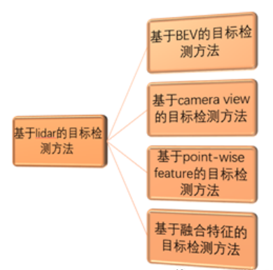
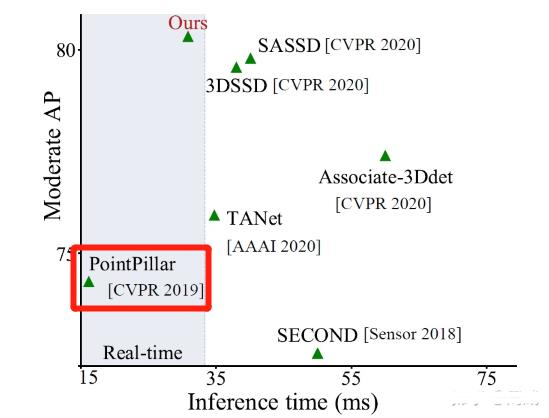
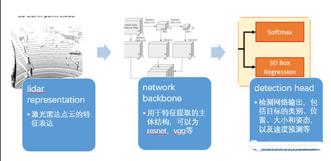
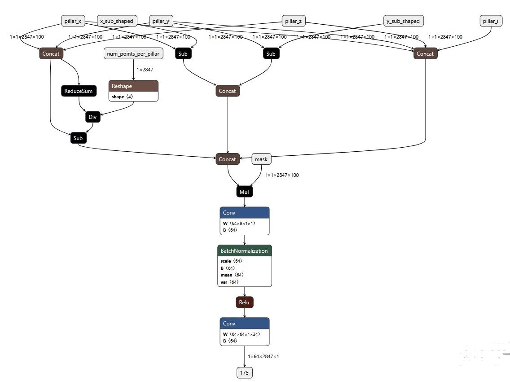

# 3D目标检测 —— PointPillars 学习笔记

## 一、点云知识

### 1.1 点云数据特点

点云数据应表示为具有 N 行和至少 3 列的 numpy 数组。每行对应于单个点，其在空间（x，y，z）中的位置使用至少3个值表示

    如 Pi={Xi, Yi, Zi, ...} 表示空间中的一个点，
    则 Point Cloud = {P1, P2, P3,…..Pn} 表示一组点云数据
        [
            1.11, 2.22, 3.33,
            2.66, 3.77, 4.88,
            9.55, 5.66, 7.77,
            ...
        ]

若点云数据来自 _LIDAR_ 传感器，那么它可能具有每个点的附加值，例如 _反射率_，其是在该位置中障碍物反射多少激光光束的量度。则点云数据可能是 N x 4 阵列。

* 图像与点云数据比较：

|        | __图像数据__ | __点云数据__ |
| ------ | ------       | ------ |
| __坐标值__ | 正整数         | 正/负实数 |
| __原点__   | 左上角         | 传感器位置 |
| __坐标轴__ | 水平-x  竖直-y | x-前  y-左  z-上 |
| __特点__   | 缺少目标尺寸   | 缺少纹理信息,无序性,旋转性 |

### 1.2 点云数据特征表达
	
为了完成 3D 目标检测任务，需要对稀疏点云做特征表达，有 3 种方式：
>* 离散化后，手动（hand-crafted）提取特征，或者利用深度学习模型提取特征(BEV/camera-view)
>* 点对点特征（point-wise feature）提取
>* 特征融合  

__根据激光雷达的成像原理，可以有两种离散化方式:__
>1. 基于旋转平面(即激光坐标系下的 xy 坐标平面)离散化，可以得到 BEV (bird's eye view) 图
>2. 在垂直方向离散化(即 z 轴), 可以得到 Camera view 的图

* __目前BEV方法在目前的自动驾驶的3D目标检测方案中应用较广__

#### 1.2.1 BEV图

BEV图由激光雷达点云在XY坐标平面离散化后投影得到，其中需要人为规定离散化时的分辨率，即点云空间多大的长方体范围（Δl * Δw * Δh）对应离散化后的图像的一个像素点（或一组特征向量）
    
    如点云 20cm * 20cm * Δh 的长方体空间，对应离散化后的图像的一个像素点

>根据长方体空间中点云点特征表达方式不同可以分为:
>>1. __hand-crafted feature__
    通过使用一些统计特征来完成对长方体中点云的特征表达，主要特征包括：最大高度值、与最大高度值对应的点的强度值、长方体中点云点数、平均强度值等。
    主要问题是丢弃了很多点云的点，缺失了很多信息。          
>>2. __voxel-feature__
    广泛应用于 _second、voxelnet、pointpillars_ 等方法中。voxel的特征表达主要包括3个步骤：点云预处理、点特征表达、voxel特征表达得到BEV图。实现中一般使用 VFE layer，在后面论文中会有详细介绍。
    基于voxel的特征表达，极大的缓解了点云在做BEV投影时信息丢失的问题，提高了整个网络的效果。

#### 1.2.2 Camera view图

在这种离散化方式中，激光雷达的垂直分辨率（线数）和水平分辨率（旋转角分辨率）是两个重要的可以依据的参数，分别对应了离散化后的图像的高和宽。如对于一个 64 线，角分辨率 0.2°，10Hz 扫描频率的激光雷达，离散化后的图像大小为 64 * 1800 * c。
和图像成像效果很相似，所以称为 camera view，但也同时会引入图像成像的缺点，如遮挡、缺失深度信息等。  

#### 1.2.3 点对点特征(point-wise feature)提取

自动驾驶中激光雷达的点云比较稀疏，应用在稠密点云的特征表方法可以借鉴，很难直接使用。
另外，大部分 point-wise 特征提取的方法，只能融合局部信息的特征，与更广的上下文信息的联系比较弱，而 BEV 或者 camera view 的表达方式，在使用合适的网络结构做特征提取时，感受野可以覆盖全图。
__因此，在自动驾驶领域，point-wise特征不会直接用来做3D目标检测任务。__

#### 1.2.4 特征融合

不同的激光雷达点云特征提取方法有各自的优缺点，但联合在一起使用时，能发挥更好的作用，如在 waymo 的文章 _《End-to-End Multi-View Fusion for 3D Object Detection in LiDAR Point Clouds》_ 中，融合了不同的特征表达方式，对小目标和远处目标的检测效果增益很大。

---

## 二、Kitti数据集 

### 2.1 概述

KITTI数据集由德国卡尔斯鲁厄理工学院和丰田美国技术研究院联合创办，原始数据采集于2011年的5天，共有180GB数据。其中，train-set 中包含 7481 个场景，test-set 中包含 7518 个场景。

KITTI数据集的数据采集平台装配有2个灰度摄像机，2个彩色摄像机，一个Velodyne 64线3D激光雷达，4个光学镜头，以及1个GPS导航系统。

> 该数据集用于评测立体图像(stereo)，光流(optical flow)，视觉测距(visual odometry)，3D物体检测(object detection)和3D跟踪(tracking)等计算机视觉技术在车载环境下的性能。KITTI包含市区、乡村和高速公路等场景采集的真实图像数据，每张图像中最多达15辆车和30个行人，还有各种程度的遮挡与截断。整个数据集由389对立体图像和光流图，39.2 km视觉测距序列以及超过200k 3D标注物体的图像组成[1] ，以10Hz的频率采样及同步。总体上看，原始数据集被分类为’Road’, ’City’, ’Residential’, ’Campus’ 和 ’Person’。对于3D物体检测，label细分为car, van, truck, pedestrian, pedestrian(sitting), cyclist, tram以及misc组成。
* 注意：目前很多论文只评估 Car、Pedestrian 两个类别的精度。

### 2.2 Labels 标注含义

|  __index__  | __Name__ | __描述__ | __范围/类型__ |
| ------      | ------   | ------   |    ------   |
| 1 | type | 目标类别 | 'Car','Van','Truck','Pedestrian','Person_sitting','Cyclist','Tram','Misc','DontCare' |
| 2 | truncated | 物体是否被截断 | 0（非截断）到1（截断）float |
| 3 | occluded | 物体是否被遮挡 | 整数0，1，2，3表示被遮挡的程度 |
| 4 | alpha | 物体的观察角度 | -pi~pi |
| 5-8 | xmin，ymin，xmax，ymax | 2D 目标坐标 | float |
| 9-11 | height, width, length | 3D 目标尺寸 | float |
| 12-14 | x, y, z | 3D 物体的位置(相机坐标) | float, 单位: 米 |
| 15 | rotation_y | 物体前进方向与相机坐标系x轴夹角 | -pi~pi |

### 2.3 相机坐标系换算

涉及到的坐标系共有3个，分别是：
* velodyne frame
* camera frame
* image frame

calib文件夹下的 txt 文件，描述了各相机之间坐标换算的校准数据，其格式如下：

    P0: 7.070493000000e+02 0.000000000000e+00 6.040814000000e+02 0.000000000000e+00 0.000000000000e+00 7.070493000000e+02 1.805066000000e+02 0.000000000000e+00 0.000000000000e+00 0.000000000000e+00 1.000000000000e+00 0.000000000000e+00
    P1: 7.070493000000e+02 0.000000000000e+00 6.040814000000e+02 -3.797842000000e+02 0.000000000000e+00 7.070493000000e+02 1.805066000000e+02 0.000000000000e+00 0.000000000000e+00 0.000000000000e+00 1.000000000000e+00 0.000000000000e+00
    P2: 7.070493000000e+02 0.000000000000e+00 6.040814000000e+02 4.575831000000e+01 0.000000000000e+00 7.070493000000e+02 1.805066000000e+02 -3.454157000000e-01 0.000000000000e+00 0.000000000000e+00 1.000000000000e+00 4.981016000000e-03
    P3: 7.070493000000e+02 0.000000000000e+00 6.040814000000e+02 -3.341081000000e+02 0.000000000000e+00 7.070493000000e+02 1.805066000000e+02 2.330660000000e+00 0.000000000000e+00 0.000000000000e+00 1.000000000000e+00 3.201153000000e-03
    R0_rect: 9.999128000000e-01 1.009263000000e-02 -8.511932000000e-03 -1.012729000000e-02 9.999406000000e-01 -4.037671000000e-03 8.470675000000e-03 4.123522000000e-03 9.999556000000e-01
    Tr_velo_to_cam: 6.927964000000e-03 -9.999722000000e-01 -2.757829000000e-03 -2.457729000000e-02 -1.162982000000e-03 2.749836000000e-03 -9.999955000000e-01 -6.127237000000e-02 9.999753000000e-01 6.931141000000e-03 -1.143899000000e-03 -3.321029000000e-01
    Tr_imu_to_velo: 9.999976000000e-01 7.553071000000e-04 -2.035826000000e-03 -8.086759000000e-01 -7.854027000000e-04 9.998898000000e-01 -1.482298000000e-02 3.195559000000e-01 2.024406000000e-03 1.482454000000e-02 9.998881000000e-01 -7.997231000000e-01

其中，P0, P1, P2, P3 矩阵有 12 个数，R0_rect 矩阵有 9 个数，Tr_velo_to_cam 矩阵有 12 个数。
转换过程需要涉及到 3 个转换矩阵，分别是 P2，R0_rect，Tr_velo_to_cam

>设为velodyne frame坐标下的点 (x, y, z, 1)
>> 1. Tr_velo_to_cam *  : 将 velodyne frame 中的点投影到编号为0的camera frame      
>> 2. R0_rect * Tr_velo_to_cam *  : 将 velodyne frame 中的点投影到编号为2的camera frame，结果格式为（x, y, z, 1），直接取前三个就是投影结果，z<0的是相机后面的点
>> 3. P2 * R0_rect * Tr_velo_to_cam *  : 将 velodyne frame 中的点投影到编号为2的image frame，结果格式为（u, v, w），注意此时得到的 u,v 并非是像素坐标，需要除以 w 才是最后的像素图像坐标。那么投影前的 3D object 有8个点，投影到image frame上也有8个（u, v）点，如何得到对应的 2D 检测框呢？取8个点（u, v）的最大值最小值就是 2D 检测框的对角坐标 

---

## 三、PointPillars 

### 3.1 前言
> PointPillars 是2019年出自工业界的一篇Paper。该模型最主要的特点是检测速度和精度的平衡。该模型的平均检测速度达到了62Hz(i7 CPU + 1080ti GPU)，最快速度达到了105Hz，确实遥遥领先了其他的模型。截止目前依旧是kitti排行榜上速度最快的模型， 是为数不多可以应用在自动驾驶领域的模型。这里我们引入CIA-SSD模型中的精度-速度图，具体对比如下所示:

### 3.2 点云目标检测思路介绍

基于点云的目标检测方法可以分成3个部分：
* lidar representation (点云特征表达)
* network backbone (特征提取骨干网络)
* detection head (检测头网络)
如下图所示:

在 1.2 节中已经介绍过几种常见的点云特征表达，而 PointPillars 属于其中的 __基于BEV的目标检测方法__，则该方法如下图所示：

在本文研究的由 __mmlab__ 复现的 __openPCdet__ 框架中的实现思路如下图所示：

在代码 detector3d_template.py:22 中可以看到 Detector3DTemplate 基类的网络拓扑列表如下所示，在子类中必须由配置文件描述各模块的实现方式(若无此模块可跳过)
        
        self.module_topology = ['vfe', 'backbone_3d', 'map_to_bev_module', 'pfe', 
                                'backbone_2d', 'dense_head',  'point_head', 'roi_head']

#### 3.2.1 生成BEV图

BEV 图由激光雷达点云在 XY 坐标平面离散化后投影得到，其中需要人为规定离散化时的分辨率，即点云空间多大的长方体范围（Δl * Δw * Δh）对应离散化后的图像的一个像素点（或一组特征向量），如点云 20cm * 20cm * Δh 的长方体空间，对应离散化后的图像的一个像素点。
> 在 bev generator 中，需要根据 Δl * Δw * Δh 来生成最后 L * W * H 大小的 bev 特征图，该特征图是 network backbone 特征提取网络的输入，因此该特征图的大小对整个网络的效率影响很大，如 pointpillars 通过对 voxelnet 中 bev generator 的优化，整个网络效率提高了7ms。

#### 3.2.2 Backbone

BEV 图会传入 backbone 完成特征提取功能，网络结构的设计需要兼顾性能和效果，一般都是在现有比较大且性能比较好的网络结构基础上进行修改。Backbone 的原理与普通 2D-image 下的 backbone 没有区别，一般分为2部分：

* top-down　产生空间分辨率逐步降低/通道逐渐增多的feature map
* second network 做 upsample 和 concatenation, 精细化feature

#### 3.2.3 Detection head

Head部分包括两个任务，即：
* 目标分类
* 目标定位

>由于bev将点云用图像的形式呈现，同时保留了障碍物在三维世界的空间关系，因此基于bev的目标检测方法可以和图像目标检测方法类比：目标分类任务与图像目标检测方法中目标分类任务没有差别；而目标定位任务可以直接回归目标的真实信息，但与图像目标检测方法中目标定位任务不同，该任务需要给出 __旋转框__。与图像目标检测方法相同，基于bev的目标检测方法的detection head也分成 __anchor base (VoxelNet / PointPillars等)__ 的方法和 __anchor free (pixor 等)__ 的方法。

### 3.3 PointPillars 介绍

#### 3.3.1 VoxelNet 和 SECOND 算法概述

早期的一些方法侧重于使用 __3D卷积__ 或点云到图像的投影。而最近的方法倾向于从鸟瞰角度观察激光雷达点云，这种方式的优势为没有尺度模糊和几乎没有遮挡。然而，鸟瞰图往往非常稀疏，这使得卷积神经网络的直接应用不切实际且效率低下。这个问题的一个常见解决方法是将 XY 平面划分为一个规则的网格，例如 10 x 10 厘米，然后对每个网格单元中的点进行手工特征编码方法。然而，此类方法可能不是最佳的，因为硬编码特征提取方法泛化能力较差。

__VoxelNet__ 是在该领域真正进行 end2end 学习的首批方法之一。 VoxelNet 将空间划分为 voxels ，对每个 voxel 应用一个 PointNet，然后使用一个 3D卷积中间层以巩固垂直轴，然后应用 2D卷积检测架构。虽然 VoxelNet 性能很强，但 4.4Hz 的推理时间太慢，无法实时部署。 最近 __SECOND__ (使用 __稀疏3D卷积__ 替换普通 3D卷积) 提高了 VoxelNet 的推理速度，__但 3D卷积仍然是一个瓶颈。__

#### 3.3.2 PointPillars 的思路及实现

##### 3.3.2.1 伪图片生成

__PointPillars__ 采用了一种不同于上述两种思路的点云建模方法。从模型的名称PointPillars可以看出，该方法将 Points 转化成一个个的 Pillar（柱体），从而构成了伪图片的数据。

__具体步骤如下：__
* 按照 XY 轴将点云划分为网格，凡落入同网格的数据被视为在一个pillar
* 每个点用一个 __D = 9__ 维的向量表示，分别为 (x, y, z, r, xc, yc, zc, xp, yp), 其中:

        (x, y, z, r) 为该点云的真实坐标信息（三维）和反射强度; 
        (xc, yc, zc) 为该点云所处Pillar中所有点的几何中心； 
        (xp, yp) 为 (x-xc, y-yc) ，反映了点与几何中心的相对位置。   

* 假设每个样本中有 __P__ 个非空的pillars，每个pillar中有 __N__ 个点云数据，那么这个样本就可以用一个 __(D, P, N)__ 张量表示

        如何保证每个 pillar 中有 N 个点云数据？
        如果每个 pillar 中的点云数据数据超过 N 个，那么我们就随机采样至 N 个;
        如果每个 pillar 中的点云数据数据少于 N 个，少于的部分我们就 padding 0  

* 实现张量化后，使用一个简化的 PointNet 对点云数据进行特征提取，将 D = 9 维度转换为 C 维度，得到一个 __(C, P, N)__ 张量，接着按照 Pillar 维度(N) 进行 MaxPooling 操作，得到 __(C, P)__ 特征图，再将 __P__ 转换为 __(H, W)__, 即 P = H * W, 获取到 __(C, H, W)__ 的 __Pseudo-Image(伪图片)__    

以上便完成了点云数据的张量化，直观图示如下：

__在OpenPCdet中的实现如下：__

点云数据 -> 伪图片数据的实现（pillar_vfe.py:104）：

    def forward(self, batch_dict, **kwargs):
        voxel_features, voxel_num_points, coords = batch_dict['voxels'], batch_dict['voxel_num_points'], batch_dict['voxel_coords']
        points_mean = voxel_features[:, :, :3].sum(dim=1, keepdim=True) / voxel_num_points.type_as(voxel_features).view(-1, 1, 1)
        f_cluster = voxel_features[:, :, :3] - points_mean

        f_center = torch.zeros_like(voxel_features[:, :, :3])
        f_center[:, :, 0] = voxel_features[:, :, 0] - (coords[:, 3].to(voxel_features.dtype).unsqueeze(1) * self.voxel_x + self.x_offset)
        f_center[:, :, 1] = voxel_features[:, :, 1] - (coords[:, 2].to(voxel_features.dtype).unsqueeze(1) * self.voxel_y + self.y_offset)
        f_center[:, :, 2] = voxel_features[:, :, 2] - (coords[:, 1].to(voxel_features.dtype).unsqueeze(1) * self.voxel_z + self.z_offset)

        if self.use_absolute_xyz:
            features = [voxel_features, f_cluster, f_center]
        else:
            features = [voxel_features[..., 3:], f_cluster, f_center]

        if self.with_distance:
            points_dist = torch.norm(voxel_features[:, :, :3], 2, 2, keepdim=True)
            features.append(points_dist)
        features = torch.cat(features, dim=-1)

        voxel_count = features.shape[1]
        mask = self.get_paddings_indicator(voxel_num_points, voxel_count, axis=0)
        mask = torch.unsqueeze(mask, -1).type_as(voxel_features)
        features *= mask
        for pfn in self.pfn_layers:
            features = pfn(features)    # PFN layer 将 (D, P, N) -> (C, P, N)
        features = features.squeeze()
        batch_dict['pillar_features'] = features
        return batch_dict

其中的 PFNLayer 如下（pillar_vfe.py:8）：

    class PFNLayer(nn.Module):
        def __init__(self,
                    in_channels,
                    out_channels,
                    use_norm=True,
                    last_layer=False):
            super().__init__()
            
            self.last_vfe = last_layer
            self.use_norm = use_norm
            if not self.last_vfe:
                out_channels = out_channels // 2

            if self.use_norm:
                self.linear = nn.Linear(in_channels, out_channels, bias=False)
                self.norm = nn.BatchNorm1d(out_channels, eps=1e-3, momentum=0.01)
            else:
                self.linear = nn.Linear(in_channels, out_channels, bias=True)

            self.part = 50000

        def forward(self, inputs):
            if inputs.shape[0] > self.part:
                # nn.Linear performs randomly when batch size is too large
                num_parts = inputs.shape[0] // self.part
                part_linear_out = [self.linear(inputs[num_part*self.part:(num_part+1)*self.part])
                                for num_part in range(num_parts+1)]
                x = torch.cat(part_linear_out, dim=0)
            else:
                x = self.linear(inputs)
            torch.backends.cudnn.enabled = False
            x = self.norm(x.permute(0, 2, 1)).permute(0, 2, 1) if self.use_norm else x
            torch.backends.cudnn.enabled = True
            x = F.relu(x)
            x_max = torch.max(x, dim=1, keepdim=True)[0]

            if self.last_vfe:
                return x_max
            else:
                x_repeat = x_max.repeat(1, inputs.shape[1], 1)
                x_concatenated = torch.cat([x, x_repeat], dim=2)
                return x_concatenated

* 将上述伪图像生成过程导出 onnx 模型，并可视化模型结果图如下：

##### 3.3.2.2 Backbone Encoder特征提取

Backbone 有两个子网络：一个 top-down 的网络逐步降采样产生特征，第二个网络执行上采样和 top-down 特征的 concat。

>top-down 网络可以用一系列块 Block(S,L,F) 来表征。每个 block 的 stride = S（相对于原始输入伪图像）。一个 block 有 L 个 3x3 2D conv 层和 F 个输出通道，每层后跟 BatchNorm 和 ReLU。
>>层内的第一个卷积 stride = S / Sin 以确保块在接收到 stride = Sin 的输入 blob 后在 stride = S 上运行, 一个 block 中的所有后续卷积的 stride = 1。

>每个 top-down 的最终特征通过上采样和 concat 进行组合。
>>首先，对特征进行上采样，从初始步长 Up(Sin,Sout,F) 到最终 stride = Sout（两者都相对于原始伪图像）使用通道数 F 的转置卷积(__ConvTranspose__)。接下来应用 BatchNorm 和 ReLU。最终输出特征是源自不同 stride 的所有特征的 concat

以上便完成了 Backbone 特征提取过程，论文图示如下：

__在OpenPCdet中的实现如下：__

Backbone 的网络实现（base_bev_backbone.py:6）：

    class BaseBEVBackbone(nn.Module):
        def __init__(self, model_cfg, input_channels):
            super().__init__()
            self.model_cfg = model_cfg

            if self.model_cfg.get('LAYER_NUMS', None) is not None:
                assert len(self.model_cfg.LAYER_NUMS) == len(self.model_cfg.LAYER_STRIDES) == len(self.model_cfg.NUM_FILTERS)
                layer_nums = self.model_cfg.LAYER_NUMS
                layer_strides = self.model_cfg.LAYER_STRIDES
                num_filters = self.model_cfg.NUM_FILTERS
            else:
                layer_nums = layer_strides = num_filters = []

            if self.model_cfg.get('UPSAMPLE_STRIDES', None) is not None:
                assert len(self.model_cfg.UPSAMPLE_STRIDES) == len(self.model_cfg.NUM_UPSAMPLE_FILTERS)
                num_upsample_filters = self.model_cfg.NUM_UPSAMPLE_FILTERS
                upsample_strides = self.model_cfg.UPSAMPLE_STRIDES
            else:
                upsample_strides = num_upsample_filters = []

            num_levels = len(layer_nums)
            c_in_list = [input_channels, *num_filters[:-1]]
            self.blocks = nn.ModuleList()
            self.deblocks = nn.ModuleList()
            for idx in range(num_levels):
                cur_layers = [
                    nn.ZeroPad2d(1),
                    nn.Conv2d(
                        c_in_list[idx], num_filters[idx], kernel_size=3,
                        stride=layer_strides[idx], padding=0, bias=False
                    ),
                    nn.BatchNorm2d(num_filters[idx], eps=1e-3, momentum=0.01),
                    nn.ReLU()
                ]
                for k in range(layer_nums[idx]):
                    cur_layers.extend([
                        nn.Conv2d(num_filters[idx], num_filters[idx], kernel_size=3, padding=1, bias=False),
                        nn.BatchNorm2d(num_filters[idx], eps=1e-3, momentum=0.01),
                        nn.ReLU()
                    ])
                self.blocks.append(nn.Sequential(*cur_layers))
                if len(upsample_strides) > 0:
                    stride = upsample_strides[idx]
                    if stride >= 1:
                        self.deblocks.append(nn.Sequential(
                            nn.ConvTranspose2d(
                                num_filters[idx], num_upsample_filters[idx],
                                upsample_strides[idx],
                                stride=upsample_strides[idx], bias=False
                            ),
                            nn.BatchNorm2d(num_upsample_filters[idx], eps=1e-3, momentum=0.01),
                            nn.ReLU()
                        ))
                    else:
                        stride = np.round(1 / stride).astype(np.int)
                        self.deblocks.append(nn.Sequential(
                            nn.Conv2d(
                                num_filters[idx], num_upsample_filters[idx],
                                stride,
                                stride=stride, bias=False
                            ),
                            nn.BatchNorm2d(num_upsample_filters[idx], eps=1e-3, momentum=0.01),
                            nn.ReLU()
                        ))

            c_in = sum(num_upsample_filters)
            if len(upsample_strides) > num_levels:
                self.deblocks.append(nn.Sequential(
                    nn.ConvTranspose2d(c_in, c_in, upsample_strides[-1], stride=upsample_strides[-1], bias=False),
                    nn.BatchNorm2d(c_in, eps=1e-3, momentum=0.01),
                    nn.ReLU(),
                ))

            self.num_bev_features = c_in

        def forward(self, data_dict):
            """
            Args:
                data_dict:
                    spatial_features
            Returns:
            """
            spatial_features = data_dict['spatial_features']
            ups = []
            ret_dict = {}
            x = spatial_features
            for i in range(len(self.blocks)):
                x = self.blocks[i](x)

                stride = int(spatial_features.shape[2] / x.shape[2])
                ret_dict['spatial_features_%dx' % stride] = x
                if len(self.deblocks) > 0:
                    ups.append(self.deblocks[i](x))
                else:
                    ups.append(x)

            if len(ups) > 1:
                x = torch.cat(ups, dim=1)
            elif len(ups) == 1:
                x = ups[0]

            if len(self.deblocks) > len(self.blocks):
                x = self.deblocks[-1](x)

            data_dict['spatial_features_2d'] = x

            return data_dict

* 将上述 backbone 部分导出 onnx 模型，并可视化模型结果图如下：

##### 3.3.2.3 

